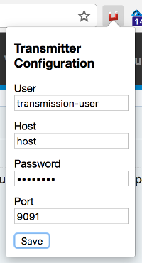
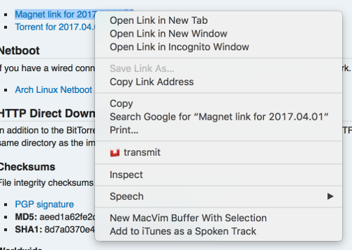

# transmitter-chrome #

### Features ###

Adds an item to the right-click link context menu that sends a magnet link to your transmission server.

### Installation ###
It's on the chrome web store :)

### Usage ###

Configure your username, host, password & port			  |Find a magnet link, right-click it & select the 'transmit' option
:----------------------------------------------------------------:|:----------------------------------------------------------------:
  						  |

Now hopefully you're downloading the torrent
